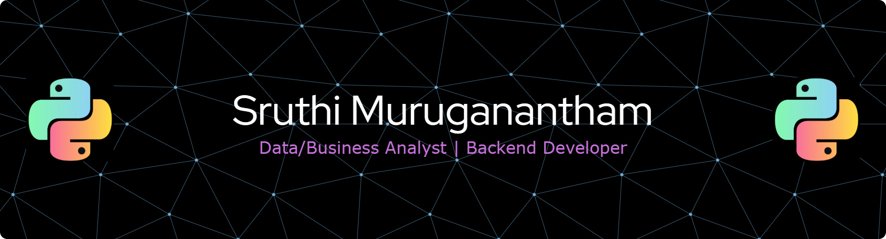

<!-- BANNER -->

  

  <b> 🎓 MS @ Northeastern University</b> 
   📍 Boston, MA

  
  
  

---

## 🧠 About Me
Hi there! 👋 I’m a data enthusiast passionate about uncovering stories hidden within numbers.

I specialize in **analytics, BI reporting, ETL pipelines, forecasting, and database design**. My goal is to transform **complex datasets into actionable insights** that drive real-world impact. I love solving data puzzles using **Python, SQL, and BI tools**, and I'm always looking for new challenges! I also build **secure, scalable full-stack applications** using React, Node.js, and MongoDB with real-world features like authentication, payments, and role-based access control.

---

## 🛠 Tech Stack

### Programming & Scripting

### Frontend

### Backend & APIs

### Databases

### BI & Analytics

### Authentication & Security

### Cloud & DevOps

### Payments

---
## 💼 Professional Experience

<table>
<tr>

<td width="33%" valign="top">

DATA & ANALYTICS

### 📊 System Engineer  
**Infosys Ltd**  
Jan 2024 – Dec 2024

- 📈 Analyzed **millions of time-series financial & operational records**
- 📊 Built **10+ Power BI dashboards** for KPIs & performance tracking
- 🎯 Improved data accuracy by **40%**
- 📉 Reduced reporting variance by **30%**
- ✅ Maintained **99%+ data accuracy** through validation checks

</td>

<td width="33%" valign="top">

PLATFORM ENGINEERING

### ⚙️ System Engineer  
**Infosys Ltd**  
Jul 2023 – Oct 2023

- ⚙️ Automated analytics & monitoring across **12 production environments**
- 🚀 Reduced anomaly response time by **40%**
- 🛠 Improved incident resolution efficiency by **65%**
- 🔍 Validated outputs across **10+ systems**
- 📊 Ensured **95%+ reporting accuracy**

</td>

</tr>
</table>

## 🚀 Featured Projects

| Project | Description | Tech Stack | Code |
|--------|-------------|------------|------|

| 🎓 **SkillBridge – Student & Teacher Platform** | Full-stack web application connecting students and instructors with secure authentication, role-based dashboards, and integrated payments. Implemented JWT + session-based auth, Google OAuth, Stripe payments, and MongoDB data models. |       | 🔗 [View Code](https://github.com/sruthim08/Skill_Bridge/tree/main) |

| 📱 **Statistical Analysis of Google Play Store Apps** | Analyzed 10,000+ apps using regression & ANOVA to identify drivers of popularity. Built statistical models to quantify relationships between app characteristics and ratings. |   | 🔗 [View Code](https://github.com/sruthim08/Statistical-Analysis-of-Google-Play-Store-Applications) |

| 📊 **Interactive Sales Dashboard** | End-to-end Power BI dashboard with advanced DAX measures, drill-through analysis, and automated refreshes. Reduced manual reporting time by 80%. |    | 🔗 [View Code](https://app.powerbi.com/groups/me/reports/d1308f4e-8b8e-4f7b-a979-7e82e666a7db/98f522f23bcfa1b64a32?experience=power-bi) |

| 🏦 **Banking System Database** | Designed a normalized MySQL database for core banking operations. Implemented stored procedures for transactions and SQL views for reporting. |   | 🔗 [View Code](https://github.com/sruthim08/Banking-System) |

| 🏠 **Property Management System** | Java Swing desktop app consolidating listings, maintenance, and loans. Features multi-enterprise architecture and role-based access control. |   | 🔗 [View Code](https://github.com/sruthim08/Property_Management_System) |

| 🚫 **Nudity Detection System** | Pixel-based detection system using YCbCr space to classify explicit content with 91% accuracy. Includes automated email alerts for moderation. |   | 🔗 [View Code](https://github.com/sruthim08/Nudity_Detection) |

| 🏨 **Hotel Management System** | Web-based system for managing room availability and reservations with 87% accuracy. Integrated secure authentication and real-time booking. |  

## 👀 Profile Views

  

---

  ⭐ Thanks for visiting — feel free to ⭐ my repos!

